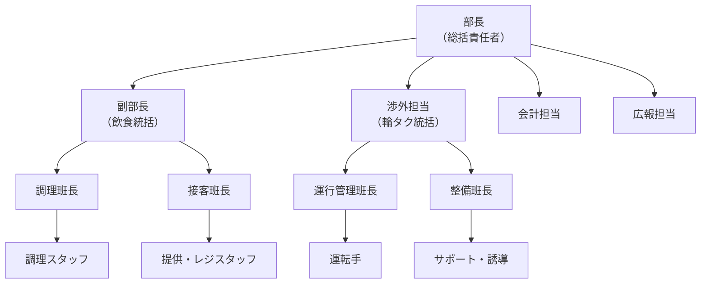

# 👥 運営体制・組織図

<Info>
  大学祭を円滑に進めるため、指揮系統と役割分担を明確にしています。
  各責任者は自分の管轄エリアの進捗を管理し、部長に報告してください。
</Info>

---

## 組織図

---

## 役職と主な責任

### 幹部（マネジメント層）

<CardGroup cols={2}>
  <Card title="部長（総括）" icon="crown">
    - 最終意思決定
    - 大学祭実行委員会との連絡
    - トラブル時の対応指示
  </Card>
  <Card title="会計" icon="wallet">
    - 予算策定・管理
    - 出納帳の記帳
    - 領収書の管理・精算
  </Card>
</CardGroup>

### テント企画（飲食部門）

| 役職 | 役割 |
|------|------|
| **飲食統括** | メニュー開発、保健所申請、仕入れ管理、シフト作成 |
| 調理班長 | 調理手順の指導、品質管理、衛生チェック |
| 接客班長 | 列整理、金銭授受の管理、クレーム対応 |

### 自由企画（輪タク部門）

| 役職 | 役割 |
|------|------|
| **輪タク統括** | 運行計画策定、車両入構申請、安全講習実施 |
| 運行管理班長 | 当日の運行ダイヤ管理、天候判断の補佐 |
| 整備班長 | 車両メンテナンス、始業前点検の実施 |

---

## 連絡体制

<Steps>
  <Step title="通常時">
    **LINEグループ** 「〇〇大祭運営」を使用。
    重要な決定事項はノート機能で共有。
  </Step>
  
  <Step title="緊急時系図">
    現場スタッフ ➔ 各班長 ➔ 各統括 ➔ 部長
    
    <Warning>
      人命に関わる緊急事態（怪我・事故）は、**現場判断で119番**通報したのち、
      速やかに部長へ報告してください。
    </Warning>
  </Step>
</Steps>
