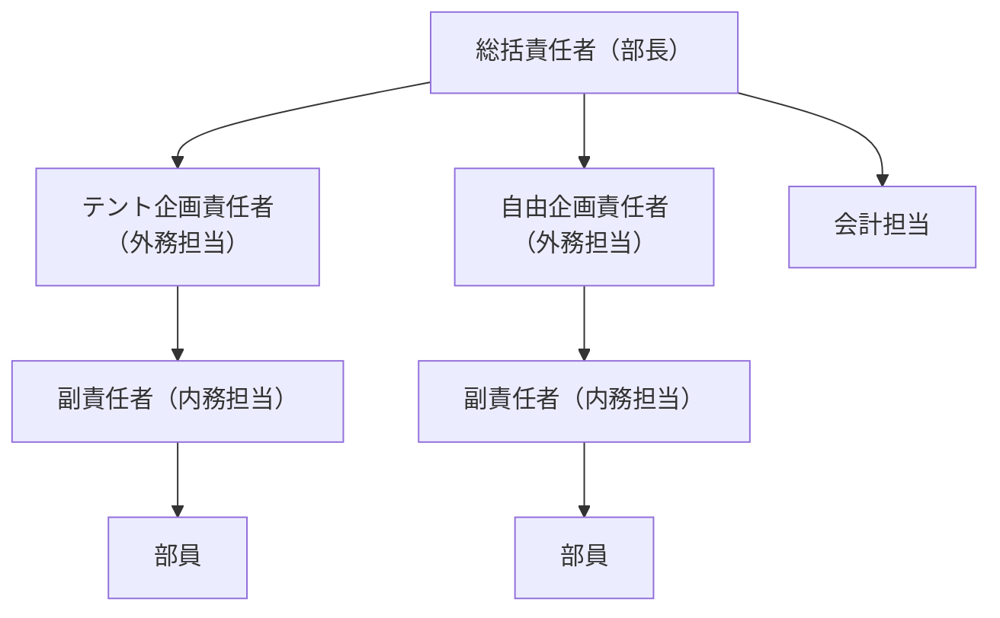

# 👥 運営体制・組織図

<Info>
  大学祭を円滑に進めるため、指揮系統と役割分担を明確にしています。
  各責任者は自分の管轄エリアの進捗を管理し、大学祭責任者に報告してください。
</Info>

---

## 組織図

---

## 役職と主な責任

### 幹部（マネジメント層）

<CardGroup cols={2}>
  <Card title="総括責任者（部長）" icon="crown">
    - 最終意思決定
    - 各企画との連絡
    - トラブル時の対応指示
  </Card>
  <Card title="会計" icon="wallet">
    - 予算管理
    - 出納帳の記帳
    - 領収書の管理・精算
  </Card>
</CardGroup>

### テント企画（飲食部門）

| 役職 | 役割 |
|------|------|
| **企画責任者** | 提出書類の作成・提出、レンタル申請、検便提出 |
| **副責任者** | レシピ考案、食材調達、シフト作成、当日運営 |
| **部員** | 働く、働く、働く |

### 自由企画（輪タク部門）

| 役職 | 役割 |
|------|------|
| **企画責任者** | 提出書類の作成・提出、支援課とのやり取り |
| **副責任者** | 制作リーダー、シフト作成、当日運営 |
| **部員** | 働く、働く、働く |

---

## 連絡体制
**Discord** 「大学祭担当」チャンネルを使用。

全体への連絡は「大学祭」チャンネルを使用。
 
