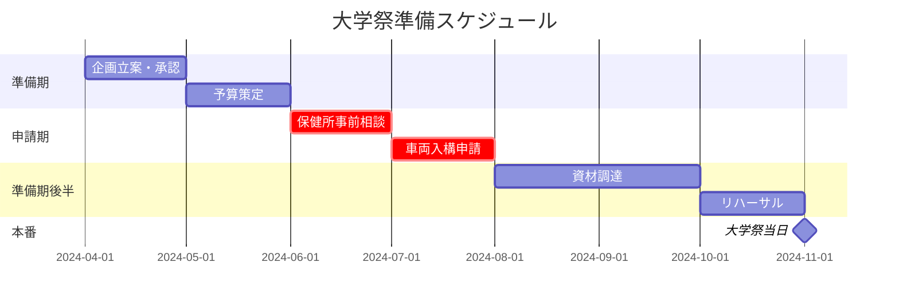

# 📅 年間スケジュール

<Info>
  大学祭に向けた準備は**4月**から始まります。
  特に保健所申請・車両入構申請は期限厳守のクリティカルパスです。
</Info>

---

## タイムライン概要

---

## 月別マイルストーン

<Steps>
  <Step title="4月：企画立案">
    - [ ] 前年度の振り返りミーティング
    - [ ] 今年度の企画コンセプト決定
    - [ ] 部内での役割分担
    - [ ] 大学祭実行委員会への参加表明
  </Step>
  
  <Step title="5月：予算策定">
    - [ ] 収支計画の作成
    - [ ] 必要資材リストの作成
    - [ ] スポンサー・協賛の検討
    - [ ] 部費からの予算確保
  </Step>
  
  <Step title="6月：保健所事前相談（クリティカル）">
    <Warning>
      **期限厳守**: 保健所への事前相談は**6月末まで**に完了すること。
      遅延した場合、飲食許可が下りない可能性があります。
    </Warning>
    - [ ] 管轄保健所への連絡・アポ取り
    - [ ] 必要書類の確認（メニュー表、調理場図面など）
    - [ ] 事前相談の実施
    - [ ] 指摘事項への対応
  </Step>
  
  <Step title="7月：車両入構申請（クリティカル）">
    <Warning>
      **期限厳守**: 車両入構許可申請は**7月中旬**締切です。
      輪タク運行のための特別許可が必要です。
    </Warning>
    - [ ] 大学施設課への申請書提出
    - [ ] 運行経路の事前確認
    - [ ] 保険加入の確認・手続き
    - [ ] 許可書の受領
  </Step>
  
  <Step title="8月〜9月：資材調達">
    - [ ] 食材の仕入れ先確定（コーヒー豆、パン、具材）
    - [ ] 調理器具の確保（ホットサンドメーカー、保温ポット）
    - [ ] 輪タク整備部品の発注
    - [ ] 装飾・看板材料の購入
  </Step>
  
  <Step title="10月：リハーサル">
    - [ ] 調理リハーサル（3回以上）
    - [ ] 輪タク試運行（安全確認）
    - [ ] シフト表の最終確定
    - [ ] 緊急時対応フローの確認
    - [ ] 保健所の最終検査対応
  </Step>
  
  <Step title="11月：本番">
    - [ ] 前日設営
    - [ ] 当日運営（2日間）
    - [ ] 撤収・片付け
    - [ ] 精算・振り返りミーティング
  </Step>
</Steps>

---

## クリティカルパス一覧

<Warning>
  以下の項目は**絶対に遅延できない**クリティカルパスです。
  余裕を持ったスケジュール管理を行ってください。
</Warning>

| 項目 | 締切 | 担当 | 備考 |
|------|------|------|------|
| 保健所事前相談 | 6月30日 | 飲食責任者 | 予約制の場合あり |
| 露店営業許可申請 | 7月15日 | 飲食責任者 | 書類不備に注意 |
| 車両入構許可申請 | 7月20日 | 輪タク責任者 | 経路図必須 |
| 保険加入手続き | 8月31日 | 渉外担当 | 対人賠償含む |
| 食材最終発注 | 10月20日 | 飲食責任者 | キャンセル不可 |

---

## 連絡・提出先

| 提出先 | 連絡先 | 備考 |
|--------|--------|------|
| 〇〇保健所 | 043-XXX-XXXX | 飲食許可関連 |
| 大学施設課 | 内線XXXX | 車両入構申請 |
| 大学祭実行委員会 | daigakusai@example.ac.jp | 企画全般 |

<Check>
  各申請の控えは必ず保管し、当日まで携帯してください。
</Check>
