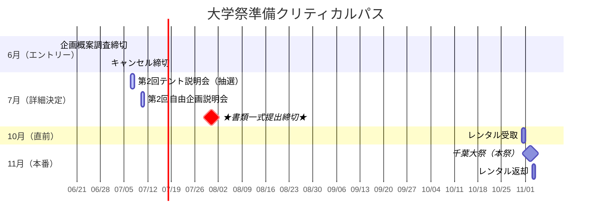

# 📅 全体スケジュール

<Info>
  第1回説明会で発表された最新のスケジュールです。
  特に**6月〜7月**は締切が連続するため、遅延なきよう注意してください。
  <Warning>
    **7月31日**の書類提出はデジタル（Google Classroom）ですが、締切時間は厳守です。
  </Warning>
</Info>

---

## 2024年 重要マイルストーン

---

## 共通ToDoリスト（期限順）

<Steps>
  <Step title="6月15日：企画概案調査 締切">
    - 全企画（テント・自由・食品）のエントリー。
    - これを出さないと参加権がありません。
  </Step>
  
  <Step title="6月30日：キャンセル締切">
    <Warning>
      この日を過ぎると**参加費・違約金**が発生します。
      撤退するならこの日までに決断すること。
    </Warning>
  </Step>
  
  <Step title="★7月31日：書類一式提出（絶対厳守）">
    Google Classroomにて以下の書類を提出。
    各企画の詳細書類は、各部門のスケジュールページを確認してください。
    
    - [ ] **誓約書**（代表者署名）
    - [ ] **共通企画書**
  </Step>
  
  <Step title="10月31日：レンタル受取">
    - 前日準備日。山王スペース＆レンタルへの発注分を事務局指定場所で受取。
  </Step>
  
  <Step title="11月3日：レンタル返却">
    - 最終日片付け後、即時返却。洗浄・清掃必須。
  </Step>
</Steps>

<Note>
  各企画ごとの詳細スケジュールは以下を参照してください。
  - [テント企画スケジュール](/food/schedule)
  - [自由企画スケジュール](/rintaku/schedule)
</Note>
