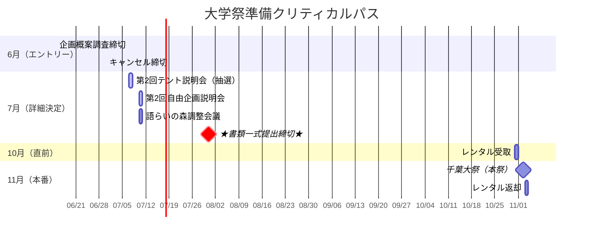

# 📅 スケジュール・ToDo

<Info>
  第1回説明会で発表された最新のスケジュールです。
  特に**6月〜7月**は締切が連続するため、遅延なきよう注意してください。
  <Warning>
    **7月31日**の書類提出はデジタル（Google Classroom）ですが、締切時間は厳守です。
  </Warning>
</Info>

---

## 2024年 重要マイルストーン

---

## ToDoリスト（期限順）

<Steps>
  <Step title="6月15日：企画概案調査 締切">
    - 全企画（テント・自由・食品）のエントリー。
    - これを出さないと参加権がありません。
  </Step>
  
  <Step title="6月30日：キャンセル締切">
    <Warning>
      この日を過ぎると**参加費・違約金**が発生します。
      撤退するならこの日までに決断すること。
    </Warning>
  </Step>
  
  <Step title="7月7日：第2回テント説明会（重要）">
    - **場所決め抽選**が行われます。部長または代理人が必ず出席すること。
    - 欠席すると場所が最悪な位置（人通りが少ない場所）になります。
  </Step>
  
  <Step title="7月10日：第2回自由企画・語らいの森会議">
    - 輪タクの運行ルートや待機場所についての調整会議。
    - 渉外担当が出席。
  </Step>
  
  <Step title="7月31日：書類一式提出（絶対厳守）">
    Google Classroomにて以下の書類を提出。
    
    - [ ] **企画書**: 輪タク運行計画など
    - [ ] **施設利用申請書**: 輪タクの待機場所・練習場所が必要な場合
    - [ ] **火気使用申請書**: ホットサンド用
    - [ ] **食材リスト**: 仕入れ先詳細
    - [ ] **誓約書**: 代表者署名
  </Step>
  
  <Step title="夏休み中：車両入構申請">
    - Googleフォームにて申請（搬入車、輪タク運搬車）。
  </Step>
  
  <Step title="10月31日：レンタル受取">
    - 前日準備日。事務局指定場所で一括受取。
  </Step>
  
  <Step title="11月3日：レンタル返却">
    - 最終日片付け後、即時返却。洗浄・清掃必須。
  </Step>
</Steps>
