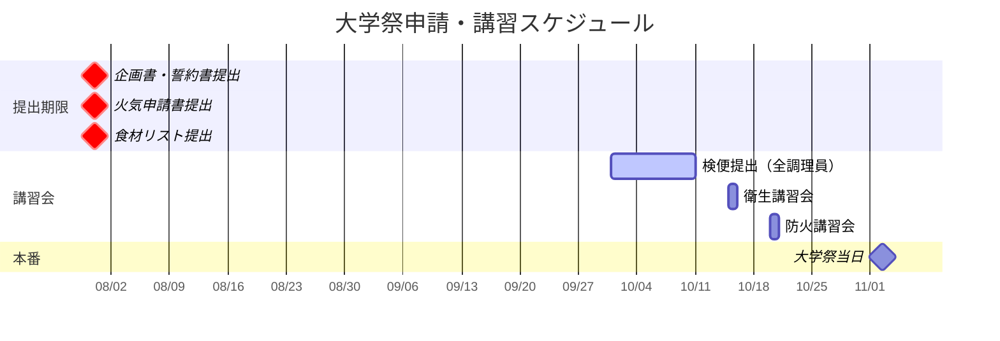

# 📅 スケジュール・ToDo

<Info>
  大学祭参加要項に基づく需要な締切をまとめています。
  中でも**7月31日**の提出期限は絶対厳守です。遅れると参加できません。
</Info>

---

## 重要マイルストーン

---

## ToDoリスト（期限順）

<Steps>
  <Step title="7月31日まで：書類提出（絶対厳守）">
    <Warning>
      遅延は一切認められません。余裕を持って提出してください。
    </Warning>
    - [ ] **企画書**: 企画内容、目的、実施方法
    - [ ] **誓約書**: 代表者署名・捺印
    - [ ] **火気使用申請書**: 使用するガス器具、ボンベの容量
    - [ ] **食材リスト**: 仕入れ先、保管方法、アレルギー物質
  </Step>
  
  <Step title="10月上旬：検便">
    - [ ] 調理担当者リストの作成
    - [ ] 検便キットの配布・回収
    - [ ] 全員分の提出確認
  </Step>
  
  <Step title="10月中旬：講習会受講">
    <Note>
      各責任者は出席必須です。代理出席の場合は事前に相談が必要。
    </Note>
    - [ ] **衛生講習会**: 飲食責任者（副部長）が出席
    - [ ] **防火講習会**: 火気責任者が出席
  </Step>
  
  <Step title="11月：大学祭当日">
    - [ ] 防火・衛生の最終チェック
    - [ ] 模擬店営業許可証の掲示
  </Step>
</Steps>

---

## 月別詳細

### 4月〜6月（準備）
- 企画立案
- 予算策定
- 保健所への事前相談（6月中）

### 7月（申請ピーク）
- **7/31**: 全書類提出締め切り
- 車両入構申請（輪タク用）

### 8月〜9月（調達）
- 資材買い出し
- 試作会

### 10月（直前）
- 衛生講習会・防火講習会
- 検便実施
- リハーサル
